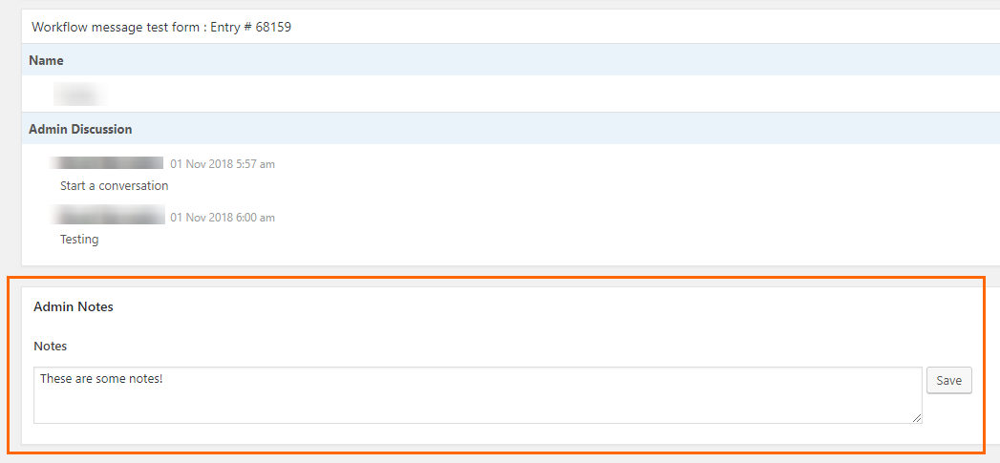

RS Gravity Flow Notes (WordPress Plugin)
==

_Adds an admin notes fields to gravity flow entries/workflows. A custom filter allows you to add multiple note fields, if desired._

    Contributors: radgh
    Donate link: https://paypal.me/radgh
    Tags: woocommerce, emails, debugging
    Requires at least: 3.2
    Tested up to: 4.9.8
    Stable tag: 1.0.0
    License: GPLv3
    License URI: http://www.gnu.org/licenses/gpl-3.0.txt

## Description ##

Adds an admin notes fields to gravity flow entries/workflows. A custom filter allows you to add multiple note fields, if desired.

## Installation ##

1. Upload the plugin files to `/wp-content/plugins/rs-gravity-flow-notes/`, or install the plugin through the WordPress plugins screen.
1. Activate the plugin through the 'Plugins' screen in WordPress
1. Edit any Gravity Flow workflow and find the Admin Notes field.

## Frequently Asked Questions ##

None yet

## Screenshots ##

## Changelog ##

#### 1.0
* First release

## Upgrade Notice ##

None yet.